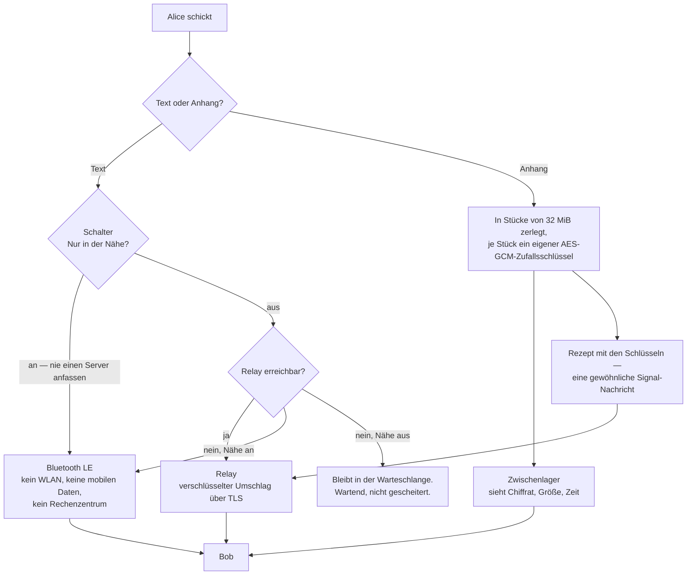

Diese Seite auf [Englisch](README.md).

# BitDM

**Ein verschlüsselter Messenger ohne Telefonnummer, ohne Benutzernamen, ohne
Konto. Deine Adresse *ist* dein öffentlicher Schlüssel.**

[](LICENSE)


| Plattform | Zustand |
|---|---|
| **Android 9+** | veröffentlicht, signiertes APK |
| **Windows x64** | gebaut, unsigniertes Zip |
| **Linux** | Projektdateien vorhanden, nichts gebaut |
| **Web** | baut, unfertig |

Die meisten Messenger fragen zuerst nach deiner Nummer. BitDM fragt nach gar
nichts. Beim ersten Start erzeugt es ein Schlüsselpaar; die 56 Zeichen, die es
dir zeigt, sind der öffentliche Teil davon.

Das hat eine Folge, die man leicht überliest und kaum überschätzen kann:
**kein Server kann dir den falschen Schlüssel unterschieben.** Er müsste dafür
die Adresse ändern — und die Adresse hast du bereits. Es gibt kein Verzeichnis,
das man vergiften könnte, weil es kein Verzeichnis gibt.

```
tayn-bret-xl2d-i6f6-i5h4-cleu-salt-5mr3-ed3a-m3yo-bafm-qwqf-wdwo-rd2p
└─ base32( pubkey[32] ‖ sha256(pubkey)[:3] ) — 35 Byte, genau 56 Zeichen
```

Drei Prüfsummen-Bytes statt zwei, und der Grund ist eine Zeile wert: 35 Byte
gehen glatt in base32 auf, es gibt also nie ein `=` abzuschneiden und wieder
anzuhängen. Der Nebeneffekt sind 24 statt 16 Bit Vertipper-Erkennung.

> [!WARNING]
> **Diese Software wurde nicht unabhängig geprüft.** Sie verschickt echte
> Nachrichten, und die Überlegung hinter jedem Teil ist aufgeschrieben, aber
> niemand von außen hat das Ergebnis durchgesehen. Lies
> [Bekannte Lücken](#bekannte-lücken), bevor du dich darauf verlässt.

---

## Wie eine Nachricht reist

Es gibt drei Wege, und welchen eine Nachricht nimmt, entscheidet genau eine
Stelle — `app/lib/core/nah/wegwahl.dart`. Nie zwei Wege für dieselbe Nachricht:
das wären zwei Verschlüsselungen eines Textes und zwei Schlüsselketten
nebeneinander im Double Ratchet.



Das Zerlegen von Anhängen ist keine Vorsicht um ihrer selbst willen. AES-GCM
ist gebrochen und nicht bloß geschwächt, sobald ein Schlüssel zweimal auf
dieselbe Nonce trifft; ein frischer Zufallsschlüssel je Stück beseitigt den
Zähler, der sonst jeden Abbruch und jede Fortsetzung überleben müsste. Die
Stücknummer reist in den authentifizierten Daten mit, ein Lager, das Stück 3
gegen Stück 5 tauscht, erzeugt also einen Entschlüsselungsfehler statt einer
stillschweigend falschen Datei.

---

## Drei Dinge, die wirklich anders sind

**1 · Die Adresse ist der Schlüssel.** Keine Anmeldung, keine Abfrage, kein
Vertrauen in ein Verzeichnis. Einen Kontakt prüfst du, indem du 56 Zeichen
vergleichst, nicht indem du darauf vertraust, dass ein Server eine
Telefonnummer zu einem Schlüssel zugeordnet hat.

**2 · Es geht auch ganz ohne Server.** Zwei Telefone, die nebeneinanderliegen,
tauschen Nachrichten über Bluetooth LE aus. Auf zwei Geräten mit abgeschalteten
mobilen Daten gemessen: **325 Byte in 1,35 Sekunden** — die eine Messung auf
dieser Seite, für die es kein Protokoll im Repository gibt. Die Funkstrecke
darunter wurde auf denselben zwei Telefonen getrennt gemessen und ist
aufgeschrieben: **120 ms bis der andere gefunden ist, 700 Byte in 202 ms** über
GATT, und an keiner Stelle ein Systemdialog
([`docs/NAHBEREICH.md`](secure-messenger/docs/NAHBEREICH.md)).

Um sich zu finden, ohne auszuposaunen, wer sie sind, senden die Geräte
**Leuchtfeuer** statt Adressen: sechs Byte je Kontakt, gerechnet aus dem
gemeinsamen Geheimnis und dem laufenden 15-Minuten-Fenster.

```
Leuchtfeuer = HMAC-SHA256( gemeinsames_Geheimnis, "bitdm-nearby-v1" ‖ Sender-Pubkey ‖ be64(Fenster) )[:6]
gemeinsames_Geheimnis = X25519( eigener privater Identitätsschlüssel, sein öffentlicher )
```

Wer das Geheimnis hat, erkennt seinen Kontakt. Wer es nicht hat, sieht sechs
Byte Rauschen, die sich jede Viertelstunde ändern. Der eigene Schlüssel des
Senders steckt in der Eingabe, Alice sendet also etwas anderes aus als Bob — ein
mitgeschnittenes Leuchtfeuer lässt sich nicht abspielen, um die Gegenseite zu
spielen. Beim Suchen werden drei Fenster geprüft und nicht eines, weil zwei
Telefone niemals dieselbe Uhr haben und ein Gerät, das jede Viertelstunde für
eine Minute verschwindet, beim Nutzer als "geht manchmal nicht" ankommt.

**3 · Du kannst das Ganze selbst betreiben.** Der Relay ist eine einzige
Python-Datei und eine systemd-Unit. Ein Befehl richtet ihn ein:

```bash
curl -fsSL https://bitdm.net/install.sh | sudo bash
```

Ein ungelesenes Skript in eine Shell zu pipen ist eine Vertrauensfrage, und die
richtige Antwort darauf ist Misstrauen. Lade es herunter, lies es, führe es dann
aus — oder sieh dir erst jeden Schritt an, ohne dass etwas verändert wird:

```bash
curl -fsSL https://bitdm.net/install.sh | sudo bash -s -- --dry-run
```

---

## Stand

| Baustein | Zustand | Wie das festgestellt wurde |
|---|---|---|
| Signal-Protokoll, X3DH + Double Ratchet | läuft | `libsignal_protocol_dart` 0.8.2, die Bibliothek, die Signal benutzt |
| Nachrichten über den Relay | läuft | Ende zu Ende über den laufenden Relay |
| Nahbereich, ohne Netz | **in einer Richtung bewiesen** | 325 B / 1,35 s zwischen zwei Geräten, beide offline — die eine Angabe hier ohne Protokoll im Repository; unabhängig bezeugt von einem ESP32-Aufbau als fremdem Gerät |
| Nahbereich, zweite Richtung | **nicht bewiesen** | braucht ein zweites Android mit BLE 5.0 — siehe [Bekannte Lücken](#bekannte-lücken) |
| Schalter "Nur in der Nähe" | läuft | die App öffnet überhaupt keine Relay-Verbindung; `test/core/nur_nahbereich_test.dart`, `test/nah/schalter_test.dart`, `test/nah/schalter_echt_test.dart` |
| Anhänge | läuft | eigenes verschlüsseltes Zwischenlager, nie über den Relay |
| Aktualisierung über eine bestehende Installation | läuft | 1.5.0+11 → 1.5.1+12, Identität und Kontakte blieben erhalten |
| Wiederherstellung auf einem neuen Gerät | läuft | 12 BIP39-Wörter holen Identität und Kontakte zurück, nicht den Nachrichtenverlauf |
| Desktop-Programm | **baut, lässt sich nicht verknüpfen** | die Windows-Datei läuft; sie kann sich keiner bestehenden Identität anschließen — siehe [Bekannte Lücken](#bekannte-lücken) |
| Unabhängige Sicherheitsprüfung | **keine** | — |

Für den Nahbereichs-Beweis stand **absichtlich ein ESP32 auf der Gegenseite.**
Zwei BitDM-Telefone, die miteinander reden, beweisen nur, dass derselbe Code
sich mit sich selbst einig ist. Ein fremdes Gerät, das nichts kennt als das
Format auf der Leitung, ist ein echter Zeuge.

Nebenbei hat dieser Aufbau etwas gemessen, was die Spezifikationen nicht
deutlich machen: **Bluetooth 4.2 kann erweitertes Advertising nicht empfangen.**
Beide Seiten brauchen BLE 5.0.

### Plattformen

| Plattform | Zustand | Nahbereich über BLE | Aufwecken per Push | Angebotene Sperrfaktoren |
|---|---|---|---|---|
| **Android 9+** | veröffentlicht, signiertes APK | Android 12+ | UnifiedPush | App-Passwort, Fingerabdruck, Geräte-PIN, Hardware-Schlüssel |
| **Windows x64** | gebaut, unsigniertes Zip | nein | nein — die Verbindung bleibt stattdessen offen | App-Passwort |
| **Linux** | Projektdateien vorhanden, nichts gebaut | nein | nein | App-Passwort |
| **Web** | baut, unfertig | nein | nein | App-Passwort |

Nahbereich, Push und drei der vier Sperrfaktoren liegen hinter einem
Android-Plattformkanal, geschrieben in Kotlin. Auf dem Desktop werden sie gar
nicht angezeigt, statt angezeigt und kaputt zu sein: der erste Windows-Build bot
vier Faktoren an, von denen drei nicht funktionieren konnten, und einer davon
sprach auf einem PC von "der PIN, dem Muster oder dem Passwort dieses
Telefons".


**Funktionen neben dem Kern** — Antworten, Reaktionen, Bearbeiten, Für alle
löschen, Umfragen, Gruppen (bis 20), Sprachnachrichten (Android), geplante und
angeheftete Nachrichten, Notiz an mich, Tipp-Anzeige, Suche, verschlüsselte
Sicherung, Panik-Passwort. Was davon woher kommt, was bewusst fehlt und welche
Grenzen es gibt: [`docs/FUNKTIONSVERGLEICH.md`](secure-messenger/docs/FUNKTIONSVERGLEICH.md).

---

## Holen

### Android

```bash
curl -fsSLO https://bitdm.net/bitdm-1.7.0.apk
sha256sum bitdm-1.7.0.apk
```

Android warnt beim Installieren. Es warnt bei **jeder** App, deren Zertifikat
Google nicht kennt, und diese Warnung sagt nichts über diese Datei. Diese zwei
Werte sagen etwas, und sie sind nicht dasselbe:

| Was | Wert |
|---|---|
| **Diese Datei** (sha256 des APK) | `86dfb9e55a19e35aeed5373f5ce3acc114611620cce3aef9763938e577eb7599` |
| **Signierschlüssel** (Zertifikatsabdruck) | `e325b01c08a1a679b6aac20ac9ae3ee255591b46b37dd92717f97085acc22063` |

```bash
apksigner verify --print-certs bitdm-1.7.0.apk
```

Der erste Wert deckt nur diese eine Datei. Der zweite deckt jede künftige
Fassung — Android nimmt eine Aktualisierung nur an, wenn sie denselben
Signierschlüssel trägt. **Wenn dieser zweite Wert sich jemals ändert, ist es
nicht mehr dieselbe App.**

Braucht **Android 9 oder neuer.** Der Nahbereich braucht **Android 12**;
darunter verweigert die App ihn mit einem klaren Grund, statt nach der
Standortberechtigung zu fragen, die eine BLE-Suche dort sonst verlangt. Die
Einreichungen bei Google Play und F-Droid sind vorbereitet, nicht erfolgt.

### Windows

[`bitdm-windows-1.7.0.zip`](https://bitdm.net/bitdm-windows-1.7.0.zip) (auch am
[GitHub-Release](https://github.com/Henner4746/BitDM/releases/tag/v1.7.0)) — 15.943.227 Byte,
auspacken und `bitdm.exe` starten.

| Was | Wert |
|---|---|
| **Diese Datei** (sha256 des Zip) | `79712d5ff8d64c67dcfbc96f9412a0af202e7561b8ff37f3f42c2b19ddc481f4` |

SmartScreen wird davor warnen, und daran ist hier nichts zu ändern: das
Signieren von Windows-Programmen braucht ein Authenticode-Zertifikat von einer
kommerziellen CA, und der Android-Schlüssel ersetzt das nicht. Die Antwort ist
dieselbe wie bei Play Protect — die Prüfsumme veröffentlichen, damit aus der
Warnung etwas wird, das du nachprüfen kannst, statt etwas, das du glauben
musst.

**Lies zuerst [Bekannte Lücken](#bekannte-lücken), wenn du BitDM schon auf
einem Telefon benutzt.** Eine zweite Installation mit denselben 12 Wörtern
schließt sich deiner Identität nicht an, sie übernimmt sie.

Ein Inno-Setup-Skript für ein Installationsprogramm liegt unter
[`app/windows/bitdm.iss`](secure-messenger/app/windows/bitdm.iss) — es
installiert nach `%LOCALAPPDATA%`, ohne Administratorrechte zu verlangen, und
legt keinen Autostart-Eintrag an. Eine `.exe` daraus ist noch nicht
veröffentlicht.

---

## Was es schützt — und was nicht

Hier genau zu sein zählt mehr, als stark zu klingen.

**Geschützt**

- Der Inhalt von Nachrichten, gegen jeden einschließlich des Relay-Betreibers — Ende zu Ende, mit Vorwärtssicherheit
- Das Unterschieben eines falschen Schlüssels durch einen Server — die Adresse *ist* der Schlüssel
- Das Zuordnen von Verkehr im Nahbereich — wechselnde Leuchtfeuer statt Kennungen
- Der Inhalt von Anhängen gegenüber dem Zwischenlager — es hält Chiffrat und sieht nie einen Schlüssel
- Metadaten am Relay, *sofern du deinen eigenen betreibst*

**Nicht geschützt**

- **Wer mit wem redet, an einem Relay, der nicht dir gehört.** Ein Relay kann
  keine Inhalte lesen, sieht aber notwendigerweise, welche Adressen wann eine
  Verbindung aufbauen und wie viel sie senden. Dagegen gibt es zwei Antworten.
  Selbst betreiben — das kostet einen einzigen Befehl. Und der Schalter
  **Nur in der Nähe**: er öffnet überhaupt keine Relay-Verbindung — keine
  Registrierung, kein Abfragen, kein Push-Endpunkt, kein Zwischenlager. Seine
  Grenze gehört zum Entwurf: er verbietet den Server, er baut keinen zweiten
  Weg. Schalte ihn ohne Bluetooth ein, und Nachrichten bleiben in der
  Warteschlange stehen. Er ersetzt auch den Flugmodus nicht — er spricht nur
  für BitDM.
- **Ein übernommenes Gerät.** Die Schlüssel liegen im Android-Schlüsselspeicher;
  Root oder eine bösartige Tastatur hebeln jeden Messenger aus, diesen
  eingeschlossen.
- **Die Tatsache, dass du BitDM benutzt.** BLE-Aussendungen sind sichtbar als
  *irgendein* Gerät, das sendet, und TLS zu einem Relay ist sichtbar als eine
  Verbindung.
- **Deine Anwesenheit in einem Raum, im Nahbereich.** Das Leuchtfeuer schützt
  deine Identität, nicht die Tatsache, dass ein Gerät sendet. Android wechselt
  die Bluetooth-Adresse von selbst, aber wer lange genug im selben Raum steht,
  kann Geräte trotzdem auseinanderhalten.
- **Alles, was eine gerichtliche Anordnung an den Betreiber deines Relays
  herausholen würde.** Betreib ihn selbst.

Der Nahbereich hat **keine Anwesenheitsanzeige,** und zwar absichtlich: der
Teil, der weiß, wer in Reichweite ist, gibt das nicht an die Oberfläche weiter,
und eine Nachricht zeigt, wie sie gereist ist, nie wer in der Nähe war. Was es
gibt, ist ein **Schalter je Kontakt** — du kannst für eine bestimmte Person
unsichtbar werden. Aus heißt, dass an diesen Kontakt kein Leuchtfeuer geht *und*
von ihm keines erwartet wird; beide Richtungen zusammen, weil die andere
Regelung dich ihn nicht mehr finden ließe, ihm aber weiterhin zeigte, wo du
bist. Nachrichten an diesen Kontakt nehmen dann immer den Relay.

---

## Selbst bauen

Der Sinn eines offenen Messengers ist, dass du das fertige Programm nicht
glauben musst.

```bash
cd secure-messenger/app
flutter build apk --release        # → build/app/outputs/flutter-apk/app-release.apk
flutter build windows --release    # → build/windows/x64/runner/Release/
```

Braucht Flutter mit Dart-SDK ^3.12.2 und JDK 17. Dein APK wird nicht Byte für
Byte zur veröffentlichten Prüfsumme passen — es ist mit *deinem* Schlüssel
signiert, nicht mit unserem. Eine abweichende Prüfsumme ist hier normal.

Die Windows-Ausgabe ist ein Verzeichnis und keine einzelne Datei. `bitdm.exe`
ist 90 KiB groß und allein nutzlos: `sqlite3mc.dll` ist die verschlüsselte
Datenbank, `webcrypto.dll` die Kryptografie, und der eigentliche Dart-Code
liegt in `data/app.so`. Gib den ganzen Ordner weiter. Für ein
Installationsprogramm statt eines Zip:

```powershell
& "C:\Program Files (x86)\Inno Setup 6\ISCC.exe" windows\bitdm.iss
```

Tests:

```bash
cd secure-messenger/app && flutter test      # 820 Tests: App + Krypto + Nahbereich
cd secure-messenger && py -m pytest server/test_relay.py server/test_blob.py -q   # 35 + 25
```

Die Relay-Tests prüfen nicht bloß, dass die Zustellung funktioniert. Sie prüfen
die Angriffe: Registrierung ohne Besitznachweis, falsche Signaturen,
Überschreiben eines fremden Schlüsselbündels, Leerräumen der Prekeys,
übergroße Umschläge, doppelte Zustellung.

<details>
<summary><strong>Zwei Fallen beim Bauen des Android-APK unter Windows</strong> — ein blockiertes <code>build/</code>-Verzeichnis und eine überschriebene <code>GeneratedPluginRegistrant.java</code></summary>

Jede ist drei fehlgeschlagene Versuche wert, wenn man kalt hineinläuft.

- `Unable to delete directory … mergeReleaseAssets` — ein Gradle-Daemon hält
  Dateien fest. Abhilfe: `cd android && ./gradlew --stop`, dann `build/`
  löschen. **Nicht** wahllos Prozesse abschießen; `adb` stirbt mit ihnen und
  nimmt ein angeschlossenes Telefon mit.
- `Package dev.flutter.plugins.integration_test does not exist` — ein früherer
  Gerätetest hat `GeneratedPluginRegistrant.java` umgeschrieben. Nur
  `flutter clean` hilft; `flutter pub get` erzeugt dieselbe Datei erneut.

</details>

---

## Eigenen Relay betreiben

Ein Relay trägt verschlüsselte Umschläge zwischen Geräten hin und her, die
einander nicht direkt erreichen. Lesen kann er sie nicht.

```bash
curl -fsSL https://bitdm.net/install.sh | sudo bash
```

Debian oder Ubuntu. Das Skript fragt nach einer Domain und einer E-Mail-Adresse,
prüft, ob die Domain wirklich auf die Maschine zeigt, installiert was fehlt und
richtet Zertifikat, nginx und den Dienst ein. Keine Konfigurationsdatei, die man
anfassen muss. Ein zweiter Lauf ist gefahrlos, und einen bestehenden Relay
übernimmt es nicht, ohne zu fragen.

> [!NOTE]
> **Alle Beteiligten brauchen denselben Relay.** Es gibt keine Föderation
> zwischen Instanzen. Zwei Leute an verschiedenen Relays können sich nicht
> schreiben.

Anhänge brauchen ein zweites, getrenntes Zwischenlager — richte den Relay ein
und vergiss das Lager, dann scheitern Anhänge mit einem Fehler, der wie ein
Netzproblem aussieht. Siehe
[`docs/ZWISCHENLAGER.md`](secure-messenger/docs/ZWISCHENLAGER.md).

---

## Aufbau

```
secure-messenger/
  app/lib/               Flutter-App — 67 Dateien, 22.471 Zeilen Dart
    main.dart              5.078 davon; hier liegen die Plattform-Weichen
    core/crypto/           libsignal-Sitzungen, Identität, Adresskodierung, BIP39
    core/nah/              Nahbereich: Leuchtfeuer, BLE-Funk, Zerlegen, Wegwahl
    core/anhang/           Anhänge: Stückkrypto, Rezept, Zwischenlager-Anbindung
    core/store/            verschlüsselte lokale Datenbank
  app/test/              73 Dateien, 16.980 Zeilen — 820 Tests, alle grün
  app/integration_test/  1 Datei, 153 Zeilen — Anhang-Durchsatz auf echter Hardware
  app/android/…/kotlin/  8 Dateien, 2.574 Zeilen — BLE, Schlüsselspeicher,
                         Vordergrunddienst (plus 2 Testdateien)
  app/windows/           CMake, Runner und bitdm.iss für das Installationsprogramm
  app/linux/  app/web/   Projektdateien; kein veröffentlichter Build
  app/tool/symbol/       3 Python-Skripte, die das App-Symbol rendern und verteilen
  server/                Python-Relay + Zwischenlager, 4.508 Zeilen einschließlich Tests
  docs/                  Betrieb, Bedrohungsnotizen, Messungen
  website/               bitdm.net
LICENSE                  AGPL-3.0
PLAN.md                  Entwurfsprotokoll — stellenweise älter als der Code
```

In `core/nah/` steckt das interessante Problem. Android gibt **jeder Rolle eine
eigene Zufalls-BLE-Adresse** — eine Aussendung, eine zweite Aussendung und eine
ausgehende GATT-Verbindung sind für die Gegenseite drei verschiedene Adressen.
Zwei getrennte Fehler in diesem Projekt hatten genau diese eine Ursache.

---

## Bekannte Lücken

- **Keine unabhängige Prüfung.** Niemand außerhalb dieses Projekts hat die
  Kryptografie, das Protokoll oder die Umsetzung durchgesehen.
- **Der Nahbereich in der zweiten Richtung** ist unbewiesen: das Telefon sendet
  nur, wenn es etwas in der Warteschlange hat, und der Kontakt des
  ESP32-Aufbaus bleibt schwebend, weil der Beweis libsignal-taugliches X3DH auf
  dem Aufbau braucht. Blockiert durch das fehlende zweite Android mit BLE 5.0.
- **Eine Identität je Gerät, und das ist es, was den Desktop begrenzt.** Eine
  zweite Installation mit denselben 12 Wörtern *übernimmt die Adresse*, statt
  sich ihr anzuschließen: jede Installation erzeugt absichtlich eine neue
  Registrierungs-ID, und `/register` auf dem Relay ersetzt das Schlüsselbündel
  und verwirft die alten Einmal-Prekeys. Der Windows-Build fängt deshalb mit
  einer leeren Unterhaltungsliste an, und das Telefon, das diese Adresse bisher
  benutzt hat, ist nicht mehr erreichbar. Verbundene Geräte brauchen das
  Sesame-Protokoll, das nicht gebaut ist.
- **Der Web-Build ist nicht fertig.** Er lässt sich übersetzen, und das Layout
  steht; ein Programm, auf das du dich verlassen solltest, ist er nicht.
- **Für Linux gibt es keinen veröffentlichten Build.** Die Projektdateien sind
  da, hergestellt wurde daraus nichts.
- **Die Windows-Datei ist unsigniert,** und das Installationsprogramm aus
  `bitdm.iss` ist nicht gebaut und nicht veröffentlicht.
- **Gruppen mit Grenzen:** bis 20 Mitglieder, Verteilung über Einzelsitzungen
  (noch keine Sender Keys), keine Zustellhaken je Mitglied.
- **Die Einreichungen bei Google Play und F-Droid sind vorbereitet, nicht
  erfolgt.**

---

## Lizenz

**AGPL-3.0** — [LICENSE](LICENSE).

Absichtlich nicht die GPL. Die GPL greift beim *Verbreiten* eines Programms.
Wer den Relay verändert und ihn nur betreibt, verbreitet nichts und müsste die
Änderung nie veröffentlichen — und der Relay ist genau der Teil, der sieht, wer
wann online ist. Die AGPL schließt diese Lücke, und das hält "betreib es selbst"
durchsetzbar.

Bei Software, deren ganze Behauptung darin besteht, dass du dem Betreiber nicht
vertrauen musst, ist Lesbarkeit ein Teil davon, diese Behauptung überprüfbar zu
machen.
