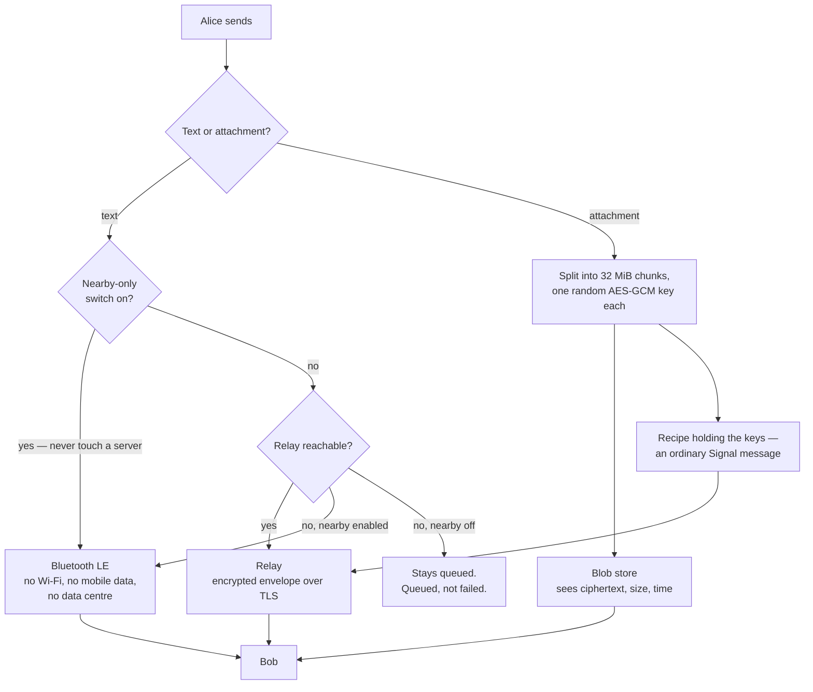

This page in [German](README.de.md).

# BitDM

**An encrypted messenger with no phone number, no username, and no account.
Your address *is* your public key.**

[](LICENSE)


| Platform | State |
|---|---|
| **Android 9+** | released, signed APK |
| **Windows x64** | built, unsigned zip |
| **Linux** | project files present, nothing built |
| **Web** | builds, unfinished |

Most messengers ask for your number first. BitDM asks for nothing. On first
launch it generates a key pair; the 56-character address it shows you is the
public half of it.

That has a consequence which is easy to miss and hard to overstate:
**no server can hand you the wrong key.** To do that it would have to change
the address — and you already have the address. There is no directory to
poison, because there is no directory.

```
tayn-bret-xl2d-i6f6-i5h4-cleu-salt-5mr3-ed3a-m3yo-bafm-qwqf-wdwo-rd2p
└─ base32( pubkey[32] ‖ sha256(pubkey)[:3] ) — 35 bytes, exactly 56 characters
```

Three checksum bytes rather than two, for a reason worth one line: 35 bytes
divide evenly into base32, so there is never a `=` to strip and re-append. The
side effect is 24 bits of typo detection instead of 16.

> [!WARNING]
> **This software has not been independently audited.** It sends real messages
> and the reasoning behind each part is written down, but no outside party has
> reviewed the result. Read [Known gaps](#known-gaps) before you rely on it.

---

## How a message travels

There are three paths, and which one a message takes is decided in exactly one
place — `app/lib/core/nah/wegwahl.dart`. Never two paths for the same message:
that would be two encryptions of one text, and two key chains side by side in
the Double Ratchet.



The attachment split is not caution for its own sake. AES-GCM is broken, not
merely weakened, the moment one key meets one nonce twice; a fresh random key
per chunk removes the counter that would otherwise have to survive every
resume and abort. The chunk number travels in the authenticated data, so a
store that swaps chunk 3 for chunk 5 produces a decryption failure instead of a
quietly wrong file.

---

## Three things that are actually different

**1 · The address is the key.** No registration, no lookup, no trust in a
directory. You verify a contact by comparing 56 characters, not by trusting
that a server matched a phone number to a key.

**2 · It works with no server at all.** Two phones next to each other exchange
messages over Bluetooth LE. Measured on two devices with mobile data switched
off: **325 bytes in 1.35 seconds** — the one measurement on this page for which
no log exists in the repository. The radio underneath was measured separately on
the same two phones and is written down: **120 ms to find the peer, 700 bytes in
202 ms** over GATT, and no system dialog at any point
([`docs/NAHBEREICH.md`](secure-messenger/docs/NAHBEREICH.md)).

To find each other without broadcasting who they are, devices emit **beacons**
instead of addresses: six bytes per contact, derived from the shared secret and
the current 15-minute window.

```
beacon = HMAC-SHA256( shared_secret, "bitdm-nearby-v1" ‖ sender_pubkey ‖ be64(window) )[:6]
shared_secret = X25519( own_private_identity, their_public_identity )
```

Hold the secret and you recognise your contact. Don't, and you see six bytes of
noise that change every quarter hour. The sender's own key is inside the input,
so what Alice emits is not what Bob emits — a recorded beacon cannot be replayed
to impersonate the other side. Three windows are checked when scanning, not
one, because two phones never share a clock and a device that vanishes for a
minute every quarter hour arrives at the user as "it works sometimes".

**3 · You can run the whole thing yourself.** The relay is one Python file and
a systemd unit. One command sets it up:

```bash
curl -fsSL https://bitdm.net/install.sh | sudo bash
```

Piping an unread script into a shell is a question of trust, and the right
answer to it is suspicion. Download it, read it, then run it — or see every
step first without changing anything:

```bash
curl -fsSL https://bitdm.net/install.sh | sudo bash -s -- --dry-run
```

---

## Status

| Component | State | How that was established |
|---|---|---|
| Signal protocol, X3DH + Double Ratchet | working | `libsignal_protocol_dart` 0.8.2, the library Signal uses |
| Messages over the relay | working | end-to-end over the live relay |
| Nearby transport, no network | **proven one direction** | 325 B / 1.35 s between two devices, both offline — the one figure here with no log in the repository; independently witnessed by an ESP32 rig acting as a foreign device |
| Nearby, second direction | **not proven** | needs a second Android with BLE 5.0 — see [Known gaps](#known-gaps) |
| Nearby-only switch | working | the app opens no relay connection at all; `test/core/nur_nahbereich_test.dart`, `test/nah/schalter_test.dart`, `test/nah/schalter_echt_test.dart` |
| Attachments | working | separate encrypted blob store, never through the relay |
| Update over an existing install | working | 1.5.0+11 → 1.5.1+12, identity and contacts survived |
| Recovery on a new device | working | 12 BIP39 words restore identity and contacts, not message history |
| Desktop client | **builds, cannot be linked** | Windows binary runs; it cannot join an existing identity — see [Known gaps](#known-gaps) |
| Independent security audit | **none** | — |

The nearby proof used an **ESP32 as the counterpart on purpose.** Two BitDM
phones talking to each other only prove that the same code agrees with itself.
A foreign device that knows nothing but the wire format is a real witness.

Along the way that rig also measured something the specs do not make obvious:
**Bluetooth 4.2 cannot receive extended advertising.** Both sides need BLE 5.0.

### Platforms

| Platform | State | Nearby over BLE | Push wake-up | Lock factors offered |
|---|---|---|---|---|
| **Android 9+** | released, signed APK | Android 12+ | UnifiedPush | app password, fingerprint, device PIN, hardware key |
| **Windows x64** | built, unsigned zip | no | no — the connection stays open instead | app password |
| **Linux** | project files present, nothing built | no | no | app password |
| **Web** | builds, unfinished | no | no | app password |

Nearby, push and three of the four lock factors sit behind an Android platform
channel written in Kotlin. On the desktop they are not shown at all rather than
shown and broken: the first Windows build offered four factors of which three
could not work, and one of them said "the PIN, pattern or password of this
phone" on a PC.

---

## Get it

### Android

```bash
curl -fsSLO https://bitdm.net/bitdm-1.5.1.apk
sha256sum bitdm-1.5.1.apk
```

Android will warn you when installing. It warns about **every** app whose
certificate Google has not seen, and that warning says nothing about this file.
These two values do, and they are not the same kind of thing:

| What | Value |
|---|---|
| **This file** (sha256 of the APK) | `62027fc7cb2aceacd74d7150dcca1ff937861c30cc420fcd35f9055dc20ee72c` |
| **Signing key** (certificate fingerprint) | `e325b01c08a1a679b6aac20ac9ae3ee255591b46b37dd92717f97085acc22063` |

```bash
apksigner verify --print-certs bitdm-1.5.1.apk
```

The first value covers only this file. The second covers every future
version — Android accepts an update only if it carries the same signing key.
**If that second value ever changes, it is no longer the same app.**

Requires **Android 9 or newer.** Nearby mode needs **Android 12**; below that
the app refuses it with a plain reason instead of asking for the location
permission a BLE scan would otherwise require. Google Play and F-Droid
submissions are prepared, not done.

### Windows

`secure-messenger/releases/bitdm-windows-1.5.1.zip` — 15,419,797 bytes, unpack
and run `bitdm.exe`.

| What | Value |
|---|---|
| **This file** (sha256 of the zip) | `08299da651e3d39e83c8c368727a9043795acd2174f6900be312527ff5187782` |

SmartScreen will warn about it, and that cannot be fixed here: Windows code
signing needs an Authenticode certificate from a commercial CA, and the Android
key is no substitute. The answer is the same one as for Play Protect — publish
the hash, so the warning becomes something you can check rather than something
you have to believe.

**Read [Known gaps](#known-gaps) first if you already use BitDM on a phone.**
A second install with the same 12 words does not join your identity, it takes
it over.

An Inno Setup script for an installer exists at
[`app/windows/bitdm.iss`](secure-messenger/app/windows/bitdm.iss) — it installs
into `%LOCALAPPDATA%` without asking for admin rights and adds no autostart
entry. No `.exe` from it is published yet.

---

## What it protects — and what it does not

Being specific here matters more than sounding strong.

**Protected**

- Message content, against anyone including the relay operator — end-to-end, forward-secret
- Key substitution by a server — the address *is* the key
- Traffic correlation in nearby mode — rotating beacons, not identifiers
- Attachment content against the blob store — it holds ciphertext and never sees a key
- Metadata at the relay, *if you run your own*

**Not protected**

- **Who talks to whom, at a relay you do not control.** A relay cannot read
  content, but it necessarily sees which addresses connect when and how much
  they send. Two answers exist. Self-hosting, which costs a single command. And
  the **nearby-only** switch, which opens no relay connection at all — no
  registration, no polling, no push endpoint, no blob store. Its limit is part
  of the design: it forbids the server, it does not build a second path. Turn it
  on without Bluetooth and messages stay queued. It is also not a substitute for
  airplane mode — it speaks for BitDM only.
- **A compromised device.** Keys live in the Android keystore; root or a
  malicious keyboard defeats any messenger, including this one.
- **The fact that you use BitDM.** BLE advertising is visible as *some* device
  advertising, and TLS to a relay is visible as a connection.
- **Your presence in a room, in nearby mode.** The beacon protects your
  identity, not the fact that a device is transmitting. Android rotates the
  Bluetooth address by itself, but someone standing in the same room long
  enough can still tell devices apart.
- **Anything a court order to your relay host would reveal.** Run it yourself.

Nearby mode has **no presence display,** deliberately: the component that knows
who is in range does not pass that on to the interface, and a message shows how
it travelled, never who was around. What does exist is a **per-contact switch**
— you can go invisible to one person in particular. Off means no beacon is sent
to that contact *and* none is expected from them; both directions together,
because the other arrangement would stop you finding them while still showing
them where you are. Messages to that contact then always take the relay.

---

## Build it yourself

The point of an open messenger is that you do not have to take the binary on
faith.

```bash
cd secure-messenger/app
flutter build apk --release        # → build/app/outputs/flutter-apk/app-release.apk
flutter build windows --release    # → build/windows/x64/runner/Release/
```

Needs Flutter with Dart SDK ^3.12.2 and JDK 17. Your APK will not match the
published hash byte for byte — it will be signed with *your* key, not ours. A
differing hash is normal here.

The Windows output is a directory, not a single file. `bitdm.exe` is 90 KiB and
useless alone: `sqlite3mc.dll` is the encrypted database, `webcrypto.dll` the
crypto, and the actual Dart code lives in `data/app.so`. Ship the whole folder.
For an installer instead of a zip:

```powershell
& "C:\Program Files (x86)\Inno Setup 6\ISCC.exe" windows\bitdm.iss
```

Tests:

```bash
cd secure-messenger/app && flutter test      # 820 tests: app + crypto + nearby
cd secure-messenger && py -m pytest server/test_relay.py server/test_blob.py -q   # 35 + 25
```

The relay tests do not just check that delivery works. They check the attacks:
registration without proof of possession, wrong signatures, overwriting someone
else's bundle, prekey drain, oversized envelopes, double delivery.

<details>
<summary><strong>Two traps when building the Android APK on Windows</strong> — a locked <code>build/</code> directory, and a rewritten <code>GeneratedPluginRegistrant.java</code></summary>

Each one is worth three failed attempts if you hit it cold.

- `Unable to delete directory … mergeReleaseAssets` — a Gradle daemon is
  holding files. Fix: `cd android && ./gradlew --stop`, then delete `build/`.
  **Do not** kill processes wholesale; `adb` dies with them and takes a
  connected phone with it.
- `Package dev.flutter.plugins.integration_test does not exist` — a previous
  device test rewrote `GeneratedPluginRegistrant.java`. Only `flutter clean`
  helps; `flutter pub get` regenerates the same file.

</details>

---

## Run your own relay

A relay carries encrypted envelopes between devices that cannot reach each
other directly. It cannot read them.

```bash
curl -fsSL https://bitdm.net/install.sh | sudo bash
```

Debian or Ubuntu. It asks for a domain and an email, checks that the domain
actually resolves to the machine, installs what is missing, and sets up the
certificate, nginx and the service. No config file to touch. Running it again
is safe, and it refuses to take over an existing relay without asking.

> [!NOTE]
> **Everyone involved needs the same relay.** There is no federation between
> instances. Two people on different relays cannot message each other.

Attachments need a second, separate blob store — set up the relay and forget
the store and attachments fail with an error that looks like a network
problem. See [`docs/ZWISCHENLAGER.md`](secure-messenger/docs/ZWISCHENLAGER.md).

---

## Layout

```
secure-messenger/
  app/lib/               Flutter app — 67 files, 22,471 lines Dart
    main.dart              5,078 of them; the platform switches live here
    core/crypto/           libsignal sessions, identity, address encoding, BIP39
    core/nah/              nearby: beacons, BLE radio, chunking, route choice
    core/anhang/           attachments: chunk crypto, recipe, blob store client
    core/store/            encrypted local database
  app/test/              73 files, 16,980 lines — 820 tests, all green
  app/integration_test/  1 file, 153 lines — attachment throughput on real hardware
  app/android/…/kotlin/  8 files, 2,574 lines — BLE, keystore, foreground service
                         (plus 2 test files)
  app/windows/           CMake, runner, and bitdm.iss for the installer
  app/linux/  app/web/   project files; no published build
  app/tool/symbol/       3 Python scripts that render and distribute the app icon
  server/                Python relay + blob store, 4,508 lines including tests
  docs/                  operations, threat notes, measurements
  website/               bitdm.net
LICENSE                  AGPL-3.0
PLAN.md                  design log — older than the code in places
```

`core/nah/` is where the interesting problem lives. Android hands **each role
its own random BLE address** — advertising, a second advertiser, and an
outgoing GATT connection are three different addresses as far as the peer is
concerned. Two separate bugs in this project had that single root cause.

---

## Known gaps

- **No independent audit.** Nobody outside this project has reviewed the
  cryptography, the protocol, or the implementation.
- **Nearby, second direction** is unproven: the phone only transmits when it has
  something queued, and the ESP32 rig's contact stays pending because proving it
  needs libsignal-compatible X3DH on the rig. Blocked on a second Android with
  BLE 5.0.
- **One identity per device, and that is what limits the desktop.** A second
  install with the same 12 words *takes the address over* instead of joining it:
  every install generates a fresh registration ID on purpose, and `/register` on
  the relay upserts the key bundle and drops the old one-time prekeys. So the
  Windows build starts with an empty conversation list, and the phone that had
  been using that address stops being reachable. Linked devices need the Sesame
  protocol, which is not built.
- **The web build is not finished.** It compiles and the layout holds; it is not
  a client you should rely on.
- **Linux has no published build.** The project files are there, nothing has
  been produced from them.
- **The Windows binary is unsigned,** and the installer from `bitdm.iss` has not
  been built or published.
- **No group chats.**
- **Google Play and F-Droid submissions are prepared, not done.**

---

## License

**AGPL-3.0** — [LICENSE](LICENSE).

Not GPL, deliberately. The GPL triggers on *distributing* a program. Someone
who modifies the relay and merely operates it distributes nothing and would
never have to publish the change — and the relay is precisely the component
that sees who is online when. The AGPL closes that gap, which is what keeps
"run it yourself" enforceable.

For a piece of software whose entire claim is that you do not have to trust the
operator, readability is part of what makes that claim checkable.
