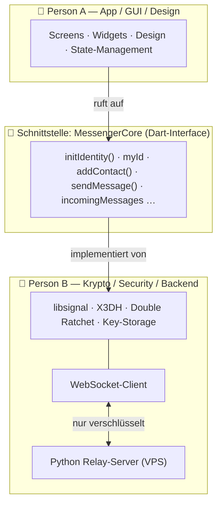

# Arbeitsaufteilung — Secure Messenger (2 Personen)

Ziel: Zwei Leute arbeiten **gleichzeitig**, ohne sich zu blockieren. Möglich wird
das durch **eine klare Trennlinie**: die Schnittstelle `MessengerCore`.

- **Person A** baut die App drüber (GUI ruft die Schnittstelle nur auf).
- **Person B** baut die Krypto/Backend drunter (implementiert die Schnittstelle).

Solange beide sich an den Vertrag halten, ist es egal, wie weit die andere Seite ist.



---

## 👤 Person A — App, Design, GUI  *(Lennard)*

**Du besitzt alles, was der Nutzer sieht und anfasst.** Du arbeitest gegen die
Schnittstelle und benutzt beim Entwickeln die **`MockMessengerCore`** (liefert
Fake-Daten + Fake-Antworten) — so läuft deine App sofort, ganz ohne Krypto.

**Aufgaben / Screens:**
- [ ] Flutter-Projekt-Setup, Navigation, Theme (Dark Mode, Farben, Typografie → cleanes Design)
- [ ] **Onboarding**: „Willkommen", Identität erzeugen (`initIdentity()`), kurze Erklärung
- [ ] **Meine ID**: eigene „lange Nummer" anzeigen, kopieren, als **QR-Code**
- [ ] **Chat-Liste** (Home): alle Kontakte + letzte Nachricht, Verbindungs-Status-Icon
- [ ] **Kontakt hinzufügen**: ID einfügen *oder* QR scannen → `addContact()`
- [ ] **Chat-Screen**: Nachrichten-Bubbles, Zeitstempel, Sende-Status, Eingabefeld → `sendMessage()`, eingehende via `incomingMessages`
- [ ] **Settings**: Anzeigename, App-Sperre, „ID teilen", Über
- [ ] State-Management (Empfehlung: **Riverpod** oder Provider), Empty-States, Ladeanimationen

**Deine Dateien:** `app/lib/ui/**`, `app/lib/state/**`, `app/assets/**`, `app/pubspec.yaml` (UI-Pakete)
**Deine Skills:** Flutter/Dart-Widgets, Design, UX. Kein Krypto-Wissen nötig.

---

## 👤 Person B — Krypto, Sicherheit, Backend

**Du besitzt alles Unsichtbare: Schlüssel, Verschlüsselung, Server.** Du
implementierst `MessengerCore` „echt".

**Aufgaben:**
- [ ] **`RealMessengerCore`**: die Schnittstelle mit echter Logik füllen
- [ ] **libsignal_protocol_dart** einbinden: Identity-Key, Prekeys, **X3DH** (Sitzungsaufbau), **Double Ratchet** (Forward Secrecy)
- [ ] **Sicherer lokaler Speicher**: privater Schlüssel + Sessions im **Android Keystore** / `flutter_secure_storage`; Nachrichten-DB verschlüsselt (SQLCipher)
- [ ] **WebSocket-Client**: verbinden, Challenge-Response-Auth (Signatur), senden/empfangen, Reconnect
- [ ] **Prekey-Verwaltung**: Bundle beim Start hochladen, nachfüllen, wenn verbraucht
- [ ] **Server** (liegt schon fertig da → pflegen & deployen):
  - `server/relay_server.py` — Relay + Key-Server *(fertig, getestet)*
  - Härten: **SQLite-Persistenz**, dann **VPS-Deployment (77.90.4.46) mit TLS/HTTPS**
- [ ] **Sicherheits-Feature**: „Safety Number"/Fingerprint zum Verifizieren eines Kontakts

**Deine Dateien:** `app/lib/core/**` (außer dem Interface), `server/**`
**Deine Startpunkte:** `core/crypto_core.py` (ID-Konzept als Referenz), `server/relay_server.py` (läuft schon), Doku von libsignal_protocol_dart.
**Deine Skills:** Krypto/Protokolle, Python-Backend, Server/Deployment. Kein Design nötig.

---

## 🤝 Gemeinsam — einmal festlegen, dann „eingefroren"

Diese Dinge ändert ihr **nur zusammen** (sonst bricht die andere Seite):

1. **Das Interface** `MessengerCore` → `app/lib/core/messenger_core.dart`
2. **Die Datenmodelle** `Message`, `Contact` (gleiche Datei)
3. **Die Server-API** (REST + WebSocket-Nachrichtenformat) → im [README](../README.md) / Server-Code
4. **Das ID-Format** (base32 + Prüfsumme) → schon definiert

> Faustregel: Ändert jemand das Interface, gibt's kurz Absprache + beide passen an.

---

## Ordnerstruktur & Ownership

```
secure-messenger/
├─ app/                      ← Flutter-App (wird mit `flutter create .` erzeugt)
│  ├─ lib/
│  │  ├─ core/
│  │  │  ├─ messenger_core.dart        🤝 gemeinsam (der Vertrag)
│  │  │  ├─ mock_messenger_core.dart   👤 A nutzt es, 🤝 gemeinsam gepflegt
│  │  │  └─ real_messenger_core.dart   👤 B (die echte Krypto)
│  │  ├─ ui/                           👤 A (alle Screens/Widgets)
│  │  └─ state/                        👤 A (State-Management)
│  └─ pubspec.yaml
├─ server/                   👤 B (Python Relay-Server, fertig+getestet)
├─ core/                     👤 B (Krypto-Referenz in Python)
└─ docs/                     🤝 (dieser Plan)
```

## Git-Workflow

- **Ein gemeinsames Repo.** Jeder arbeitet in **seinen Ordnern** → kaum Merge-Konflikte.
- **Branch pro Feature** (`feat/chat-screen`, `feat/double-ratchet`), dann **Pull Request**, der andere schaut kurz drüber.
- **`main` bleibt immer lauffähig.**
- **Niemals** private Schlüssel, `.env`, Server-Zugangsdaten committen → `.gitignore`.

---

## Meilensteine (die Punkte, wo ihr zusammensteckt)

| # | Ziel | A liefert | B liefert |
|---|------|-----------|-----------|
| **M1** | Getrennt loslegen | UI läuft mit **Mock** | `RealMessengerCore`-Gerüst + libsignal wählt |
| **M2** | Lokal echt reden | UI unverändert | echte Krypto + WS gegen **lokalen** Server (gleiches WLAN) |
| **M3** | Übers Internet | Feinschliff GUI | Server **auf VPS + TLS**, Reconnect stabil |
| **M4** | Sicher & rund | QR, Verify-Screen | Safety-Numbers, Key-Storage gehärtet, Push |

Bei **M2** wird in der App nur **eine Zeile** getauscht: `MockMessengerCore()` → `RealMessengerCore()`. Das ist der ganze Zauber der Trennung.

---

## Nächste konkrete Schritte

**Person A (du):**
1. Flutter installieren, `app/` mit `flutter create .` anlegen
2. Theme + Navigation aufsetzen
3. Onboarding- und „Meine ID"-Screen gegen `MockMessengerCore` bauen

**Person B:**
1. libsignal_protocol_dart evaluieren, `real_messenger_core.dart` anlegen
2. WebSocket-Auth-Flow gegen den laufenden `relay_server.py` testen
3. Server auf SQLite-Persistenz umstellen, dann VPS-Deployment vorbereiten

**Beide zuerst:** das Interface `messenger_core.dart` gemeinsam durchgehen und abnicken. Danach getrennt Vollgas.
